# 🚀 Generic Contract Ingestion System

[](https://python.org)
[](https://open-metadata.org)
[](https://aws.amazon.com/s3/)
[](docs/PROJECT_STRUCTURE.md)

A comprehensive, enterprise-grade data contract ingestion system for OpenMetadata with **clean modular architecture**, automated metadata management, and S3 integration.

## 📁 Clean Project Structure

```
ingestion-generic/
├── main.py                          # 🎯 Main entry point (NEW)
├── contract_ingestion.py           # 📦 Original implementation (backup)
├── ingestion-generic.yaml          # ⚙️ Configuration file
├── src/                            # 🏗️ Modular architecture (CLEAN)
│   ├── handlers/                   # 🔧 Mode handlers
│   │   ├── base_handler.py        # 🔗 Shared functionality  
│   │   ├── ingestion_handler.py   # 📊 Full ingestion mode
│   │   └── test_handler.py        # 🧪 Test and validation mode
│   ├── client/                     # 🌐 OpenMetadata client
│   │   └── omd_client.py          # 🔌 API client
│   └── utils/                      # 🛠️ Utilities  
│       ├── config.py              # ⚙️ Configuration management
│       ├── sdk.py                 # 🔧 SDK utilities
│       └── s3_client.py           # ☁️ S3 integration
├── contracts/                      # 📄 Contract definitions
├── docs/                          # 📚 Documentation (UPDATED)
│   ├── PROJECT_STRUCTURE.md      # 🏗️ Architecture overview
│   ├── REFACTORING_SUMMARY.md    # 📋 Refactoring details  
│   └── CLEANUP_SUMMARY.md        # 🧹 Cleanup documentation
└── test_results/                  # 📈 Test results
```

## ⚡ Quick Start (Updated Entry Point)

- [🎯 Features](#-features)
- [🏗️ Architecture Overview](#️-architecture-overview)
- [📊 System Flow](#-system-flow)
- [⚡ Quick Start](#-quick-start)
- [🔧 Configuration](#-configuration)
- [🚀 Key Actions](#-key-actions)
- [🎨 Domain Architecture](#-domain-architecture)
- [📈 Metadata Management](#-metadata-management)
- [🧪 Testing & Quality](#-testing--quality)
- [🔍 Troubleshooting](#-troubleshooting)
- [📚 API Reference](#-api-reference)

## 🎯 Features

### 🌟 Core Capabilities
- **Contract-Driven Ingestion**: YAML-based data contracts with automatic schema detection
- **Domain-Driven Architecture**: Multi-level domain hierarchy (Root → Subdomains → Databases → Schemas → Tables)
- **Enterprise Metadata**: Comprehensive tagging, ownership, retention policies, and data lineage
- **Multi-Environment Support**: DEV, UAT, PROD environments with intelligent fallback logic
- **S3 Integration**: Real-time sample data fetching from Bronze zone buckets
- **Advanced Testing**: Automated data quality tests with incident management

### 🔧 Technical Features
- **Tag Classifications**: Data Quality (Bronze/Silver/Gold), Business Domain, Certification Level
- **Team Management**: Dynamic team assignment with ownership patterns
- **Retention Policies**: Automated lifecycle management based on contract specifications
- **SDK Integration**: OpenMetadata Python SDK with REST API fallback
- **Error Handling**: Comprehensive logging, error recovery, and incident creation

## 🏗️ Architecture Overview

```mermaid
graph TB
    subgraph "Data Contract Ecosystem"
        CC[Contract Files<br/>📄 YAML] --> CI[Contract Ingestion<br/>🔄 Engine]
        CI --> OM[OpenMetadata<br/>📊 Catalog]
        CI --> S3[S3 Bronze Zone<br/>🪣 Data Lake]
    end
    
    subgraph "Domain Structure"
        RD[Root Domains<br/>🏢 Business Units] --> SD[Subdomains<br/>📁 Services]
        SD --> DB[Databases<br/>🗄️ Collections]
        DB --> SC[Schemas<br/>📋 Groups]
        SC --> TB[Tables<br/>📊 Assets]
    end
    
    subgraph "Metadata Layers"
        TG[Tags & Classifications<br/>🏷️] --> OW[Ownership & Teams<br/>👥]
        OW --> RP[Retention Policies<br/>⏰]
        RP --> DP[Data Products<br/>📦]
        DP --> TQ[Test Cases & Quality<br/>🧪]
    end
    
    CC --> RD
    OM --> TG
    S3 --> TB
    
    style CC fill:#e1f5fe
    style OM fill:#f3e5f5
    style S3 fill:#fff3e0
    style RD fill:#e8f5e8
    style TG fill:#fce4ec
```



## 📊 System Flow

```mermaid
sequenceDiagram
    participant User as 👤 User
    participant Engine as 🔄 Ingestion Engine
    participant Config as ⚙️ Configuration
    participant OM as 📊 OpenMetadata
    participant S3 as 🪣 S3 Bronze Zone
    participant Teams as 👥 Team Management
    
    User->>Engine: 🚀 python contract_ingestion.py
    Engine->>Config: 📖 Load ingestion-generic.yaml
    Config-->>Engine: ✅ Configuration loaded
    
    Engine->>OM: 🔗 Verify connection
    OM-->>Engine: ✅ Connected (v1.8.2)
    
    Engine->>Teams: 👥 Create teams & users
    Teams-->>Engine: ✅ Teams created
    
    par Domain Creation
        Engine->>OM: 🏢 Create root domains
        OM-->>Engine: ✅ Root domains ready
    and Tag Management
        Engine->>OM: 🏷️ Create tag classifications
        OM-->>Engine: ✅ Tags organized
    end
    
    Engine->>OM: 📁 Create subdomains
    OM-->>Engine: ✅ Subdomains linked
    
    Engine->>OM: 🗄️ Create service & databases
    OM-->>Engine: ✅ Infrastructure ready
    
    loop For each contract
        Engine->>S3: 🔍 Fetch sample data
        S3-->>Engine: 📊 Real data samples
        Engine->>OM: 📋 Create schemas & tables
        OM-->>Engine: ✅ Table created
        Engine->>OM: 🧪 Add test cases
        OM-->>Engine: ✅ Tests configured
    end
    
    Engine->>OM: 📦 Create data products
    OM-->>Engine: ✅ Products linked
    
    Engine-->>User: 🎉 Ingestion completed!
```



## ⚡ Quick Start

### 1. Prerequisites

```bash
# Python environment
python -m venv venv
source venv/bin/activate  # Windows: venv\Scripts\activate

# Install dependencies
pip install -r requirements.txt
```

### 2. Environment Setup

```bash
# Set OpenMetadata JWT token
export OPENMETADATA_JWT_TOKEN="your-jwt-token-here"

# AWS credentials (for S3 integration)
export AWS_ACCESS_KEY_ID="your-access-key"
export AWS_SECRET_ACCESS_KEY="your-secret-key"

# Target environment
export TARGET_ENVIRONMENT="dev"  # or 'uat', 'prod'
```

### 3. Run the System (Clean Architecture)

```bash
# Test configuration and connection - NEW ENTRY POINT
python main.py --mode dry-run

# Execute data quality tests  
python main.py --mode test

# Full metadata ingestion
python main.py --mode ingestion

# Other modes (lineage, profiling, monitoring)
python main.py --mode lineage
python main.py --mode profiling  
python main.py --mode monitoring
```

> **✅ Project Status**: Cleaned and organized with modular architecture  
> **📚 Documentation**: See [docs/CLEANUP_SUMMARY.md](docs/CLEANUP_SUMMARY.md) for cleanup details

## 🔧 Configuration

### Main Configuration File: `ingestion-generic.yaml`

```yaml
# OpenMetadata Connection
openmetadata:
  host: "localhost"
  port: 8585
  protocol: "http"
  jwt_token: "${OPENMETADATA_JWT_TOKEN}"

# Environment-specific overrides
environments:
  dev:
    openmetadata:
      host: "dev-openmetadata.company.com"
  uat:
    openmetadata:
      host: "uat-openmetadata.company.com"
  prod:
    openmetadata:
      host: "prod-openmetadata.company.com"

# Source Configuration
source:
  contracts_directory: "contracts"
  target_environment: "dev"

# Domain Structure
domain:
  root_name: "DataManagement"
  root_display: "Data Management Domain"

# Service Configuration
service:
  name: "DataLake"
  display: "Enterprise Data Lake"

# Tag Categories
tags:
  categories:
    data_quality:
      name: "Data Quality"
      tags:
        bronze: { name: "Bronze", description: "Raw data layer" }
        silver: { name: "Silver", description: "Cleaned data layer" }
        gold: { name: "Gold", description: "Business-ready data" }
    
    business_domain:
      name: "Business Domain"
      tags:
        asset: { name: "Asset", description: "Asset management data" }
        vehicle: { name: "Vehicle", description: "Vehicle-related data" }
        inverter: { name: "Inverter", description: "Inverter data streams" }

# Team Configuration
teams:
  default_team:
    name: "data_engineering"
    display: "Data Engineering Team"
    description: "Core data engineering team"
    
  additional_teams:
    platform_engineering:
      name: "platform_engineering"
      display: "Platform Engineering"
      description: "Platform and infrastructure team"

# Cloud Provider Settings
cloud:
  provider: "aws"
  aws:
    access_key_id: "${AWS_ACCESS_KEY_ID}"
    secret_access_key: "${AWS_SECRET_ACCESS_KEY}"
```

## 🚀 Key Actions

### 1. Contract Loading and Validation

```python
# Load and validate contracts
from src.handlers.ingestion_handler import IngestionModeHandler

# Initialize with configuration
handler = IngestionModeHandler('ingestion-generic.yaml')

# Load contracts from directory
contracts = handler.load_contracts()
print(f"Loaded {len(contracts)} valid contracts")

# Validate environment compatibility
compatible_contracts = [
    contract for contract in contracts 
    if handler.has_compatible_environment(contract)
]
```

### 2. Domain Creation with Hierarchy

```python
# Create root domains for business organization
def create_domain_hierarchy():
    """
    Create comprehensive domain hierarchy:
    Root Domains → Subdomains → Databases → Schemas → Tables
    """
    
    # Step 1: Create root domains from contract folders
    root_domains = handler.create_root_domains_with_ownership(contracts)
    
    # Step 2: Create subdomains under appropriate root domains
    subdomains = handler.create_subdomains_for_multiple_roots(
        root_domains, contracts
    )
    
    # Step 3: Create databases per root domain
    databases = {}
    for root_name, root_domain in root_domains.items():
        db_fqn = handler.create_database_with_ownership(
            service_fqn, root_name, root_domains
        )
        databases[root_name] = db_fqn
    
    return root_domains, subdomains, databases
```

### 3. Advanced Table Creation with S3 Integration

```python
# Create tables with real S3 sample data
def create_enhanced_table(contract, schema_fqn, domain_name):
    """
    Create table with comprehensive metadata and real S3 data samples
    """
    
    # Extract table configuration from contract
    table_config = extract_table_config(contract)
    
    # Fetch real sample data from S3
    s3_location = get_environment_server(contract).get('url', '')
    sample_data = fetch_s3_sample_data(s3_location)
    
    # Create table with enhanced metadata
    table_data = {
        "name": table_config['name'],
        "displayName": table_config['display_name'],
        "description": table_config['description'],
        "tableType": "Regular",
        "databaseSchema": schema_fqn,
        "columns": build_columns_from_schema(table_config['schema']),
        "tags": get_classified_tags(table_config['tags']),
        "domains": [get_domain_reference(domain_name)],
        "retentionPeriod": {
            "retentionType": "TIME_BASED",
            "retentionPeriod": f"{table_config['retention_days']}d"
        }
    }
    
    # Create table in OpenMetadata
    result = client.create_table(table_data)
    
    # Add sample data
    if sample_data and result:
        add_sample_data_to_table(result['fullyQualifiedName'], sample_data)
    
    return result
```

### 4. Tag Classification System

```python
# Implement intelligent tag classification
def classify_and_apply_tags(tags, entity_type="table"):
    """
    Classify tags into appropriate categories:
    - Data Quality: Bronze, Silver, Gold, Validated, Pending, Issues
    - Business Domain: Asset, Inverter, Vehicle, Volume, etc.
    - Certification Level: Certified, Pending, Deprecated
    """
    
    classified_tags = []
    
    for tag in tags:
        if tag in ['Bronze', 'Silver', 'Gold', 'Validated', 'Pending', 'Issues']:
            classified_tags.append({
                "tagFQN": f"Data Quality.{tag}",
                "description": f"Data quality classification: {tag}"
            })
        elif tag in ['Asset', 'Inverter', 'Vehicle', 'Volume', 'forecast']:
            classified_tags.append({
                "tagFQN": f"Business Domain.{tag}",
                "description": f"Business domain classification: {tag}"
            })
        else:
            classified_tags.append({
                "tagFQN": f"Certification Level.{tag}",
                "description": f"Certification level: {tag}"
            })
    
    return classified_tags
```

### 5. Dynamic Team Assignment

```python
# Intelligent team assignment based on domain patterns
def get_team_for_domain_dynamic(domain_identifier, context="general"):
    """
    Enhanced dynamic team assignment based on flexible domain patterns
    """
    
    domain_lower = domain_identifier.lower()
    
    # Dynamic domain-team mapping based on actual contract structure
    domain_team_mappings = [
        {
            'patterns': ['electric', 'vehicle', 'inverter', 'enode'],
            'target_team': 'data_engineering',
            'description': 'Electric Vehicles & Inverters Service'
        },
        {
            'patterns': ['energy', 'management', 'trading', 'emsys', 'ppa'],
            'target_team': 'platform_engineering', 
            'description': 'Energy Management and Trading'
        }
    ]
    
    # Match domain against patterns
    for mapping in domain_team_mappings:
        if any(pattern in domain_lower for pattern in mapping['patterns']):
            for team_name, team_info in created_teams.items():
                if mapping['target_team'] in team_name.lower():
                    return team_info, team_name
    
    # Fallback to default team
    return get_default_team()
```

### 6. Test Case Creation and Result Injection

```python
# Create and execute data quality tests
def create_comprehensive_test_case(table_fqn, contract):
    """
    Create data quality test case with automated result injection
    """
    
    # Create test case definition
    test_case_data = {
        "name": f"data_quality_test_{table_name}",
        "displayName": f"Data Quality Test for {table_name}",
        "description": f"Comprehensive data quality validation for {table_name}",
        "entityLink": table_fqn,
        "testSuite": test_suite_fqn,
        "testDefinition": "tableRowCountToEqual",
        "parameterValues": [
            {"name": "minValue", "value": "1"},
            {"name": "maxValue", "value": "1000000"}
        ]
    }
    
    # Create test case
    test_case = client.create_test_case(test_case_data)
    
    # Execute test and inject results
    if test_case:
        test_result = execute_data_quality_test(table_fqn, contract)
        inject_test_result_via_sdk(
            test_case['fullyQualifiedName'], 
            "Success" if test_result.passed else "Failed",
            test_result.message
        )
    
    return test_case

# SDK-based test result injection with fallback
def inject_test_result_via_sdk(test_case_fqn, status, message):
    """
    Inject test result using OpenMetadata SDK with comprehensive fallback
    """
    try:
        # Primary: Use OpenMetadata SDK
        timestamp = int(datetime.now().timestamp() * 1000)
        test_result = TestCaseResult(
            timestamp=timestamp,
            testCaseStatus=TestCaseStatus.Success if status == "Success" else TestCaseStatus.Failed,
            result=message[:500]  # Truncate to avoid payload issues
        )
        
        result = sdk_client.add_test_case_results(
            test_results=test_result,
            test_case_fqn=test_case_fqn
        )
        
        logger.info(f"✅ SDK test result injected: {test_case_fqn}")
        return True
        
    except Exception as e:
        logger.warning(f"SDK injection failed: {e}")
        # Fallback: Direct REST API
        return inject_test_result_via_api(test_case_fqn, status, message)
```

## 🎨 Domain Architecture

### Domain Hierarchy Visualization

```mermaid
graph TD
    subgraph "🏢 Root Domains (Business Units)"
        RD1[Energy Management<br/>and Trading]
        RD2[Electric Vehicles &<br/>Inverters Service]
    end
    
    subgraph "📁 Subdomains (Services)"
        SD1[Asset Management] --> RD1
        SD2[credentials] --> RD2
        SD3[inverter] --> RD2
        SD4[Vehicle Events] --> RD2
        SD5[Smart Charging] --> RD2
    end
    
    subgraph "🗄️ Databases (Collections)"
        DB1[contract_data_energymanagement] --> SD1
        DB2[contract_data_electricvehicles] --> SD2
        DB2 --> SD3
        DB2 --> SD4
        DB2 --> SD5
    end
    
    subgraph "📋 Schemas (Groups)"
        SC1[asset_management] --> DB1
        SC2[credentials] --> DB2
        SC3[inverter] --> DB2
        SC4[vehicle_events] --> DB2
    end
    
    subgraph "📊 Tables (Data Assets)"
        TB1[emsys_ppa_asset] --> SC1
        TB2[unknown_table] --> SC1
        TB3[EnodeCredentialEventBronze] --> SC2
        TB4[EnodeInverterEventBronze] --> SC3
        TB5[EnodeVehicleEventBronze] --> SC4
    end
    
    style RD1 fill:#e8f5e8
    style RD2 fill:#e8f5e8
    style SD1 fill:#e1f5fe
    style SD2 fill:#e1f5fe
    style SD3 fill:#e1f5fe
    style SD4 fill:#e1f5fe
    style SD5 fill:#e1f5fe
    style DB1 fill:#fff3e0
    style DB2 fill:#fff3e0
    style TB1 fill:#fce4ec
    style TB2 fill:#fce4ec
    style TB3 fill:#fce4ec
    style TB4 fill:#fce4ec
    style TB5 fill:#fce4ec
```



## 📈 Metadata Management

### Tag Classification Flow

```mermaid
flowchart TD
    Start([🚀 Start Tag Classification]) --> LoadTags[📋 Load Tags from Contract]
    LoadTags --> CheckType{🔍 Analyze Tag Type}
    
    CheckType -->|Bronze, Silver, Gold| DataQuality[🏷️ Data Quality Classification]
    CheckType -->|Asset, Vehicle, Inverter| BusinessDomain[🏢 Business Domain Classification]
    CheckType -->|Certified, Pending| CertificationLevel[✅ Certification Level Classification]
    CheckType -->|Unknown| DefaultClassification[❓ Default Classification]
    
    DataQuality --> FormatTag1["📝 Format: Data Quality.tag"]
    BusinessDomain --> FormatTag2["📝 Format: Business Domain.tag"]
    CertificationLevel --> FormatTag3["📝 Format: Certification Level.tag"]
    DefaultClassification --> FormatTag4["📝 Format: Certification Level.tag"]
    
    FormatTag1 --> ApplyToEntity[🎯 Apply to Entity]
    FormatTag2 --> ApplyToEntity
    FormatTag3 --> ApplyToEntity
    FormatTag4 --> ApplyToEntity
    
    ApplyToEntity --> ValidateApplication{✅ Validation Success?}
    ValidateApplication -->|Yes| Success[🎉 Tag Applied Successfully]
    ValidateApplication -->|No| LogError[⚠️ Log Error & Continue]
    
    LogError --> CheckMore{📝 More Tags?}
    Success --> CheckMore
    CheckMore -->|Yes| LoadTags
    CheckMore -->|No| Complete([🏁 Classification Complete])
    
    style Start fill:#e8f5fe
    style Complete fill:#e8f5fe
    style DataQuality fill:#e3f2fd
    style BusinessDomain fill:#f3e5f5
    style CertificationLevel fill:#fff8e1
    style Success fill:#e8f5fe
    style LogError fill:#ffebee
```



### Ownership Assignment Process

```mermaid
sequenceDiagram
    participant Contract as 📄 Contract
    participant Engine as 🔄 Engine
    participant TeamMapper as 🗺️ Team Mapper
    participant Teams as 👥 Teams
    participant OM as 📊 OpenMetadata
    
    Contract->>Engine: 📋 Domain identifier
    Engine->>TeamMapper: 🔍 Analyze domain patterns
    
    rect rgb(230, 245, 255)
        Note over TeamMapper: Pattern Analysis
        TeamMapper->>TeamMapper: 🔎 Check electric/vehicle/inverter patterns
        TeamMapper->>TeamMapper: 🔎 Check energy/management/trading patterns
        TeamMapper->>TeamMapper: 🔎 Apply fallback logic
    end
    
    TeamMapper->>Teams: 🎯 Find matching team
    Teams-->>TeamMapper: ✅ Team found: data_engineering
    TeamMapper-->>Engine: 👥 Return team assignment
    
    Engine->>OM: 🏷️ Apply ownership to entity
    OM-->>Engine: ✅ Ownership applied
    
    rect rgb(255, 245, 245)
        Note over OM: Known Limitation
        OM->>OM: ⚠️ Check team type (Group vs Department)
        alt Team type is Department
            OM-->>Engine: ❌ Error: Department teams cannot own entities
        else Team type is Group
            OM-->>Engine: ✅ Ownership successful
        end
    end
```



## 🧪 Testing & Quality

### Test Execution Flow

```mermaid
flowchart TD
    StartTest([🧪 Initialize Testing]) --> LoadTestSuite[📋 Load Test Suite]
    LoadTestSuite --> CreateTestCases[🔧 Create Test Cases]
    
    CreateTestCases --> TestDefinition{🎯 Test Type}
    TestDefinition -->|Row Count| RowCountTest[📊 Row Count Validation]
    TestDefinition -->|Column Schema| SchemaTest[📋 Schema Validation]
    TestDefinition -->|Data Quality| QualityTest[✨ Data Quality Check]
    TestDefinition -->|Custom Rules| CustomTest[⚙️ Custom Validation]
    
    RowCountTest --> ExecuteTest[▶️ Execute Test]
    SchemaTest --> ExecuteTest
    QualityTest --> ExecuteTest
    CustomTest --> ExecuteTest
    
    ExecuteTest --> TestResult{📈 Test Result}
    TestResult -->|Pass| InjectSuccess[✅ Inject Success Result]
    TestResult -->|Fail| InjectFailure[❌ Inject Failure Result]
    
    InjectSuccess --> TrySDK{🔧 Try SDK Injection}
    InjectFailure --> TrySDK
    
    TrySDK -->|SDK Success| LogSuccess[📝 Log SDK Success]
    TrySDK -->|SDK Fails| FallbackAPI[🌐 Fallback to REST API]
    
    FallbackAPI --> APIResult{🌐 API Result}
    APIResult -->|Success| LogAPISuccess[📝 Log API Success]
    APIResult -->|Fails| CreateIncident[🚨 Create Incident]
    
    LogSuccess --> CheckMore{📝 More Tests?}
    LogAPISuccess --> CheckMore
    CreateIncident --> CheckMore
    
    CheckMore -->|Yes| CreateTestCases
    CheckMore -->|No| CompleteTest([🏁 Testing Complete])
    
    style StartTest fill:#e8f5e8
    style CompleteTest fill:#e8f5e8
    style InjectSuccess fill:#e8f5e8
    style InjectFailure fill:#ffebee
    style CreateIncident fill:#ffebee
    style LogSuccess fill:#e8f5e8
```



### Sample Test Case Creation

```python
# Create comprehensive test cases for data quality
def create_data_quality_tests():
    """
    Create a comprehensive suite of data quality tests
    """
    
    test_definitions = [
        {
            "name": "table_row_count_validation",
            "test_type": "tableRowCountToEqual",
            "description": "Validate table has expected row count range",
            "parameters": [
                {"name": "minValue", "value": "1"},
                {"name": "maxValue", "value": "1000000"}
            ]
        },
        {
            "name": "column_values_not_null",
            "test_type": "columnValuesToNotBeNull", 
            "description": "Ensure critical columns are not null",
            "parameters": [
                {"name": "columnName", "value": "id"}
            ]
        },
        {
            "name": "freshness_validation",
            "test_type": "tableFreshnessToBeWithin",
            "description": "Validate data freshness within acceptable range",
            "parameters": [
                {"name": "maxAge", "value": "24h"}
            ]
        }
    ]
    
    for table_fqn in get_all_table_fqns():
        for test_def in test_definitions:
            create_and_execute_test(table_fqn, test_def)
```

## 🔍 Troubleshooting

### Common Issues and Solutions

#### 1. Team Ownership Errors

```bash
# Error: "Team of type Department can't own entities"
# Solution: Delete and recreate teams as Group type

python -c "
from src.client.omd_client import OMDClient
client = OMDClient(config)

# List all teams
teams = client.get_all_teams()
for team in teams:
    if team['teamType'] == 'Department':
        print(f'Deleting Department team: {team[\"name\"]}')
        client.delete_team(team['id'])
        
        # Recreate as Group
        team_data = team.copy()
        team_data['teamType'] = 'Group'
        client.create_team(team_data)
"
```

#### 2. OpenMetadata Connection Issues

```python
# Debug connection problems
def debug_openmetadata_connection():
    """
    Comprehensive connection debugging
    """
    try:
        # Test basic connectivity
        response = requests.get(f"{base_url}/v1/system/version")
        print(f"Connection Status: {response.status_code}")
        
        if response.status_code == 200:
            version = response.json()
            print(f"OpenMetadata Version: {version}")
        else:
            print(f"Error Response: {response.text}")
            
        # Test JWT authentication
        headers = {'Authorization': f'Bearer {jwt_token}'}
        auth_test = requests.get(f"{base_url}/v1/users", headers=headers)
        print(f"Authentication Status: {auth_test.status_code}")
        
    except Exception as e:
        print(f"Connection Error: {e}")
        print("Solutions:")
        print("1. Check if OpenMetadata service is running")
        print("2. Verify JWT token is valid and not expired")
        print("3. Confirm network connectivity to host:port")
```

#### 3. S3 Integration Issues

```python
# Debug S3 connectivity and permissions
def debug_s3_integration():
    """
    Test S3 connectivity and sample data fetching
    """
    import boto3
    from botocore.exceptions import ClientError
    
    try:
        # Test S3 client creation
        s3_client = boto3.client('s3')
        print("✅ S3 client created successfully")
        
        # Test bucket access
        bucket_name = "eno-dm-bronze-uat"
        response = s3_client.list_objects_v2(
            Bucket=bucket_name, 
            Prefix="enode/landing/",
            MaxKeys=5
        )
        
        if 'Contents' in response:
            print(f"✅ Found {len(response['Contents'])} objects in bucket")
            for obj in response['Contents'][:3]:
                print(f"   - {obj['Key']}")
        else:
            print("⚠️ No objects found with specified prefix")
            
    except ClientError as e:
        error_code = e.response['Error']['Code']
        if error_code == 'NoSuchBucket':
            print(f"❌ Bucket {bucket_name} does not exist")
        elif error_code == 'AccessDenied':
            print("❌ Access denied - check AWS credentials and permissions")
        else:
            print(f"❌ S3 Error: {e}")
    except Exception as e:
        print(f"❌ Unexpected error: {e}")
```

### Debug Mode Execution

```bash
# Enable comprehensive debug logging
export PYTHONPATH="${PYTHONPATH}:."
export LOG_LEVEL="DEBUG"

# Run with maximum verbosity
python contract_ingestion.py --verbose --debug
```

## 📚 API Reference

### Core Classes

#### IngestionModeHandler

```python
class IngestionModeHandler:
    """
    Main orchestrator for contract-based ingestion
    """
    
    def __init__(self, config_file="ingestion-generic.yaml"):
        """
        Initialize with YAML configuration
        
        Args:
            config_file: Path to YAML configuration file
        """
    
    def run_full_ingestion(self) -> bool:
        """
        Execute complete ingestion pipeline
        
        Returns:
            bool: Success status
        """
    
    def load_contracts(self) -> List[Dict]:
        """
        Load and validate all contract files
        
        Returns:
            List of validated contract dictionaries
        """
    
    def create_domain_hierarchy(self, contracts: List[Dict]) -> Dict:
        """
        Create complete domain hierarchy
        
        Args:
            contracts: List of contract definitions
            
        Returns:
            Dictionary containing created domains, subdomains, databases
        """
```

#### OpenMetadata182Client

```python
class OpenMetadata182Client:
    """
    OpenMetadata API client optimized for version 1.8.2
    """
    
    def create_table(self, table_data: Dict) -> Dict:
        """
        Create table with comprehensive metadata
        
        Args:
            table_data: Table definition with metadata
            
        Returns:
            Created table entity
        """
    
    def create_domain(self, domain_data: Dict) -> Dict:
        """
        Create domain with ownership and tags
        
        Args:
            domain_data: Domain definition
            
        Returns:
            Created domain entity
        """
    
    def add_sample_data(self, table_fqn: str, sample_data: List) -> bool:
        """
        Add sample data to table
        
        Args:
            table_fqn: Fully qualified table name
            sample_data: List of sample records
            
        Returns:
            Success status
        """
```

### Configuration Schema

```yaml
# Complete configuration reference
openmetadata:
  host: string              # OpenMetadata hostname
  port: integer             # Port number (default: 8585)
  protocol: string          # http/https
  jwt_token: string         # JWT authentication token

environments:              # Environment-specific overrides
  dev:
    openmetadata:
      host: string
  uat:
    openmetadata:
      host: string
  prod:
    openmetadata:
      host: string

source:
  contracts_directory: string    # Contract files location
  target_environment: string     # Target environment

domain:
  root_name: string             # Root domain identifier
  root_display: string          # Root domain display name

service:
  name: string                  # Service identifier
  display: string               # Service display name

tags:
  categories:
    category_name:
      name: string              # Category display name
      tags:
        tag_key:
          name: string          # Tag name
          description: string   # Tag description

teams:
  default_team:
    name: string               # Team identifier
    display: string            # Team display name
    description: string        # Team description
  additional_teams:
    team_key:
      name: string
      display: string
      description: string

cloud:
  provider: string             # aws/azure/gcp
  aws:
    access_key_id: string      # AWS access key
    secret_access_key: string  # AWS secret key
    session_token: string      # Optional session token
```

---

## 🎉 Success! 

Your contract ingestion system is now ready to transform your data contracts into a comprehensive, enterprise-grade metadata catalog with:

- ✅ **Domain-driven architecture** with complete hierarchy
- ✅ **Intelligent tag classification** and metadata management  
- ✅ **Dynamic team assignment** and ownership tracking
- ✅ **Real-time S3 integration** with sample data
- ✅ **Comprehensive testing** and quality management
- ✅ **Multi-environment support** with smart fallbacks

For support and advanced configuration, refer to the troubleshooting section or contact the data engineering team.

---

*Built with ❤️ for enterprise data management*