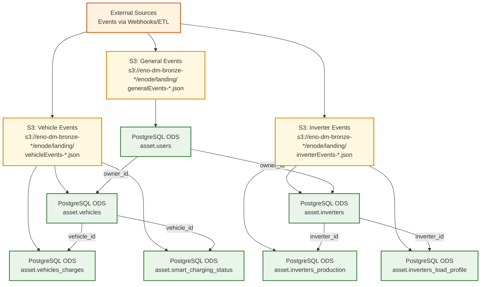

# Data Lineage Diagram for Digital Innovation & Products

## Mermaid Diagram

## Data Contract Mapping

### Bronze Layer (S3 Raw Data)

| Data Product | Location | Schema Objects | Tags |
|--------------|----------|----------------|------|
| **EnodeCredentialEventBronze** | `s3://eno-dm-bronze-*/enode/landing/*/*/generalEvents-*.json` | CredentialsInvalidatedEvent | Assets, Inverter |
| **EnodeVendorUpdateBronze** | `s3://eno-dm-bronze-*/enode/landing/*/*/generalEvents-*.json` | VendorActionUpdatedEvent | Assets, Inverter |
| **EnodeVehicleEventBronze** | `s3://eno-dm-bronze-*/enode/landing/*/*/vehicleEvents-*.json` | VehicleUpdatedEvent | Assets, Vehicle |
| **EnodeSmartChargingEventBronze** | `s3://eno-dm-bronze-*/enode/landing/*/*/vehicleEvents-*.json` | SmartChargingStatusUpdatedEvent | Assets, Vehicle |
| **EnodeInverterEventBronze** | `s3://eno-dm-bronze-*/enode/landing/*/*/inverterEvents-*.json` | InverterDiscoveredEvent | Assets, Inverter |
| **EnodeInverterStatisticsUpdateBronze** | `s3://eno-dm-bronze-*/enode/landing/*/*/inverterEvents-*.json` | InverterStatisticsUpdatedEvent | Assets, Inverter |

### Silver Layer (PostgreSQL ODS)

| Data Product | Database Schema | Table Name | Primary Key | Foreign Keys | Tags |
|--------------|-----------------|------------|-------------|--------------|------|
| **EnodeUser** | asset.users | users | owner_id | - | User, ElectricVeichle, Inverter |
| **EnodeAsset** | asset.vehicles | vehicles | id | owner_id → users.owner_id | Asset, ElectricVeichle, Inverter |
| **EnodeAsset** | asset.inverters | inverters | id | owner_id → users.owner_id | Asset, ElectricVeichle, Inverter |
| **EnodeEVEvents** | asset.vehicles_charges | vehicles_charges | id | vehicle_id → vehicles.id | ElectricVeichle, Event |
| **EnodeEVEvents** | asset.smart_charging_status | smart_charging_status | id | vehicle_id → vehicles.id | ElectricVeichle, Event, SmartCharging |
| **EnodeInverterEvent** | asset.inverters_production | inverters_production | id | inverter_id → inverters.id | Inverter, Event, Photovoltaic |
| **EnodeInverterEvent** | asset.inverters_load_profile | inverters_load_profile | id | inverter_id → inverters.id | Inverter, Event, Photovoltaic |

### Key Relationships

1. **Users** are the foundation, with `owner_id` as the primary identifier
2. **Vehicles** and **Inverters** are assets owned by users (foreign key: `owner_id`)
3. **Vehicle Events** (charges, smart charging) reference vehicles (foreign key: `vehicle_id`)
4. **Inverter Events** (production, load profile) reference inverters (foreign key: `inverter_id`)

### Data Flow

1. **Bronze Layer**: Raw JSON events stored in S3 buckets organized by event type (documented in YAML server configurations)
2. **Silver Layer**: Processed and structured data in PostgreSQL ODS with normalized relationships
3. **Event Processing**: S3 events are transformed and loaded into PostgreSQL tables maintaining referential integrity

**Note**: The actual source of data flowing into S3 is not explicitly documented in the YAML files. The data contracts only specify S3 as the server location. References to Enode API and webhooks are found only in archived contracts.
